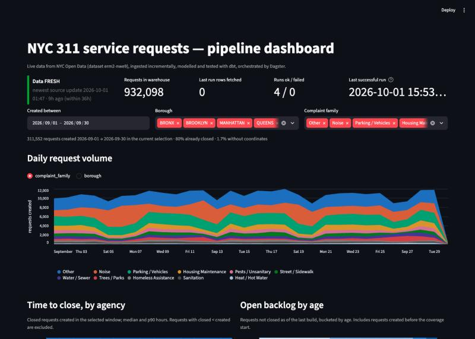
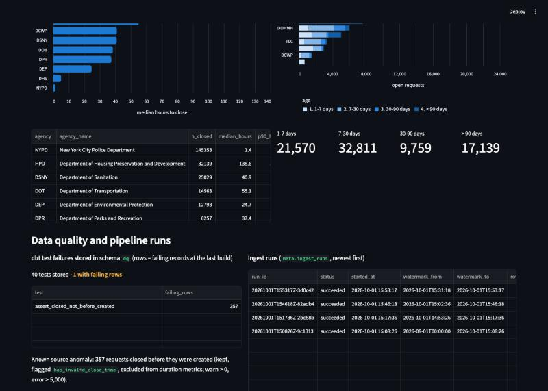

# nyc311-pipeline

An automated, incremental, tested data pipeline on a live, messy public source: **NYC 311 service requests**
(NYC Open Data, dataset `erm2-nwe9`, ~40M rows, updated daily).

```
Socrata API ──> raw parquet (append-only) ──> DuckDB ──> dbt (staging / core / marts, tests) ──> Streamlit
                      ▲                                      ▲
                      └──────────── Dagster schedule + asset checks ────────────┘
```

Status: **steps 1–4 of 6 done** (ingestion; dbt models, tests and freshness; Dagster orchestration; Streamlit
dashboard). CI/scheduled runs on GitHub Actions and operations notes follow.

## Quick start

```bash
python -m venv .venv && source .venv/bin/activate
pip install -r requirements.txt
python -m pipeline.ingest --dry-run                       # show the window and row count, fetch nothing
python -m pipeline.ingest --start 2026-09-01T00:00:00     # first run: backfill (~930k rows, ~15 min)
python -m pipeline.ingest                                 # every later run: only new/updated rows
cd dbt && DBT_PROFILES_DIR=. dbt build && dbt source freshness   # transform + test + freshness
make run-pipeline                                         # the same, orchestrated: ingest -> checks -> dbt
make dagster-ui                                           # Dagster UI at :3000 (schedule runs while it is up)
make dashboard                                            # Streamlit dashboard at :8501
pytest                                                    # unit, asset-check and dbt integration tests (~15s)
```
Python 3.11–3.13 (Dagster has no 3.14 wheels yet).

## Design doc

### 1. Ingestion: how incremental loads work

**Watermark on `:updated_at`, not on `created_date`.** A 311 request is a long-lived record: it is created,
assigned, updated and closed over days or weeks, and every change bumps Socrata's system field `:updated_at`.
Pulling on `created_date` would capture a request once and never see it close. Pulling on `:updated_at` captures
every state change, which is what makes time-to-close and backlog metrics correct.

**Run window.** Each run fetches rows with `:updated_at` in `(watermark − 15 min, run_start_utc]`:

- the upper bound is fixed at run start, so rows updated *during* the run are not half-captured; they fall into
  the next window;
- the lower bound overlaps the previous watermark by 15 minutes to absorb clock skew between this machine and
  Socrata. The overlap re-fetches a few rows; raw is append-only and staging deduplicates, so this is harmless.

**Watermark derivation.** There is no separately stored "last timestamp" that can drift. The watermark is
`max(watermark_to)` over *successful* runs in `meta.ingest_runs`. A failed run never advances it, so the next
run re-fetches the same window. If the warehouse file is deleted, the watermark is rebuilt from the raw parquet
files (`max(sys_updated_at)`): raw is the source of truth.

**Keyset pagination.** Bulk updates give tens of thousands of rows the *same* `:updated_at` (observed: 50k rows
sharing one timestamp), which breaks naive "greater than last timestamp" paging, and `$offset` paging degrades
on a 40M-row table. Pages are therefore ordered by `(:updated_at, :id)` and each page continues from the last
`(timestamp, id)` tuple: stable under ties and O(1) per page at any depth. `tests/test_ingest.py` covers the tie
case explicitly.

**Raw landing zone.** Every page becomes one zstd parquet file at
`data/raw/311/ingest_date=YYYY-MM-DD/<run_id>-<page>.parquet`, written atomically (tmp file, then rename).
All 48 declared columns are present in every file as strings, because the API omits null keys and otherwise every
batch would have a different schema. Unexpected keys (schema drift) are not dropped: they are stored as JSON in
`_extra` and the run log records them. Typing, trimming and deduplication are deliberately left to dbt so the
raw layer is a faithful replay log of what the API returned.

**Failure behaviour.** The client retries with exponential backoff on 429/5xx/timeouts. If a run fails
mid-way, the files already written stay (they are valid data), the run is marked `failed` with the error, the
watermark does not move, and the next run re-fetches the window. The result is duplicate versions in raw, never
missing rows.

**What the first runs showed (evidence for the choices above).** Backfill of `:updated_at > 2026-09-01`
landed 932,098 rows in 19 files (79 MB parquet) in 9 minutes. Of those, 345,626 requests were *created before
September* (some in 2020) but updated in September: the late-arriving-update problem is real, not theoretical.
Only 95 distinct `:updated_at` values exist in the whole month, and 533,927 rows share a single one, because the
publisher refreshes the dataset in a nightly bulk job (~01:33 UTC): plain timestamp paging would have broken on
page one. The run log also recorded 357 requests with `closed_date` before `created_date`, which becomes a dbt
test in step 2. The second run, 24 minutes later, fetched 0 rows (the nightly refresh had not happened yet),
which is the expected behaviour and the reason the schedule only needs to run a few times a day.

### 2. Data model

```
raw.service_requests  (view over parquet; every API record ever landed, text columns)
   │
   ├─ staging.stg_311__service_requests   one row per request = LATEST version; typed, cleaned, flagged
   └─ staging.stg_311__request_versions   one row per (request, source_updated_at): the replay log
   │
   ├─ core.fct_service_requests           grain: request (current state) ── dim_agency
   │                                                                     ── dim_complaint_type
   │                                                                     ── dim_location (zip)
   │                                                                     ── dim_date
   └─ core.fct_request_status_history     grain: request × observed version (previous_status, version_no)
   │
   ├─ marts.mart_daily_volume             created_date × borough × complaint family × agency
   ├─ marts.mart_resolution_time          week × agency: median / p90 hours to close
   ├─ marts.mart_open_backlog             open requests by age bucket × agency × borough
   └─ marts.mart_pipeline_health          one row: freshness, last run, counts (dashboard banner)
```

**Why a star schema with one request-grain fact.** Every question the dashboard answers — how many, how fast,
how many still open — is a question about requests. One fact at that grain keeps measures additive and makes
`unique` on `unique_key` the single most important test in the project. Dimensions exist for the three things
people slice by (agency, complaint type, place) plus a calendar. Complaint type carries a hand-written
`complaint_family` because the source has ~300 raw types and a dashboard needs ~10.

**Why a second fact for status history.** The current-state fact cannot show *when* a request moved from Open
to Closed or how often the source revises a record. `fct_request_status_history` keeps every observed version
(one row per `(unique_key, source_updated_at)`) with `LAG(status)`, so transitions are queryable. It is the
table that proves late-arriving updates are being captured rather than silently overwritten.

**Why dedupe in staging, not in ingestion.** Raw is a faithful log; collapsing to the latest version happens
once, in SQL, with an explicit ordering (`source_updated_at desc, _ingested_at desc, sys_id desc`) that is
tested. If the ordering rule ever needs to change, the raw log can be replayed.

**Incremental models.** Staging and both facts are `incremental` with `delete+insert` on their unique keys,
filtered on `_ingested_at > max(_ingested_at)` already in the model: each build scans only the parquet batches
that landed since the previous build. On the 932k-row backfill the first build took 7s; a no-change rebuild
takes 1.6s end to end. `tests/test_dbt_incremental.py` runs the real dbt project on a throwaway warehouse,
lands a late closure for an existing request, rebuilds, and asserts the fact row changed in place, the history
gained a transition row, the overlap duplicate collapsed, and untouched rows kept their original ingest stamp.

**Coverage start.** The pipeline only sees requests *updated* since 2026-09-01. A request created in 2021 and
closed in September is in the fact table (correct: it is a real closure), but counting it toward "requests
created in 2021" would be a biased sample. Cohort-style marts (`mart_daily_volume`, `mart_resolution_time`)
therefore filter to `created_at >= coverage_start()`, derived from the run log, while the fact table keeps
everything.

**Cleaning rules worth knowing** (`stg_311__service_requests`): timestamps are parsed from Socrata's
offset-less text and kept as naive NYC-local times; zips must match `^[0-9]{5}$` or become null (raw value
kept in `incident_zip_raw`); borough is upper-cased and `Unspecified` becomes null; status is normalised to six
values; nothing is dropped.

### 3. Data quality: what fails loudly, what warns, and why

| check | where | behaviour |
|---|---|---|
| `unique_key` unique and not null | staging, fact | **error** — the one invariant everything depends on |
| FK integrity fact → dims | core | **error** |
| accepted values: status, borough | staging, fact, dims | **error** — a new value means the source changed |
| lat/long inside the NYC bounding box, zip is 5 digits | staging | **error** on cleaned columns (raw values are kept) |
| `created_at` in the future | staging | **error** |
| `hours_to_close` within 0–100k | fact | **error** |
| closed before created | staging | **warn** if > 0, **error** if > 5,000 (singular test) |
| raw duplicate rate > 20 % | raw | **warn** — watermark logic is over-fetching |
| source freshness | `dbt source freshness` | **warn** at 36 h, **error** at 72 h since newest `:updated_at` |
| `hours_since_source_update` ≤ 72 | `mart_pipeline_health` | **error** — same threshold, enforced inside `dbt build` |

The closed-before-created rule is the interesting one. The source contains ~360 such rows per month,
permanently. A test that errors on them would be red forever and get ignored, which is worse than no test.
So the rows are kept, flagged (`has_invalid_close_time`), excluded from duration metrics, counted in the health
mart, and the test *warns* on any and *errors* only if the count jumps by an order of magnitude, which is the
signal that the source's semantics changed. All test failures are stored (`store_failures`) in schema `dq`, so a
failing build leaves the offending rows queryable.

Current state after the backfill: 50 tests pass, 1 warns (357 closed-before-created rows), 0 errors.
Null rates on the cleaned data: 1.1 % no coordinates, 0.6 % no valid zip, 0.1 % no borough.

### 4. Orchestration: Dagster assets, checks and schedule

**Why Dagster, and why assets rather than tasks.** The pipeline is a small DAG of *things that exist*
(a landing zone, a run log, fourteen tables), not a sequence of steps. Dagster's asset model matches that:
every dbt model is an asset with its own lineage and history, every dbt test is an asset check on the model it
tests, and the dbt source `raw.service_requests` resolves automatically to the Python asset that produces it.
A failed check is visible on the asset it belongs to, not buried in a task log.

```
ingest_311  (multi-asset)            asset checks on raw/service_requests
   ├─ raw/service_requests   ──────►    raw_is_fresh            blocking · ERROR > 72 h · WARN > 36 h
   └─ meta/ingest_runs       ──────►    raw_schema_is_stable    WARN if the last run saw undeclared columns
                                        raw_duplicate_rate_is_sane   WARN if > 20 % duplicate versions
                                      asset check on meta/ingest_runs
                                        last_ingest_run_succeeded    blocking
dbt_models  (dbt build)              36 dbt tests → asset checks on their models
                                     groups: ingestion → staging → core → marts (lineage reads left to right)
```

**Blocking checks.** `raw_is_fresh` and `last_ingest_run_succeeded` are *blocking*: if raw is stale or the
ingest run failed, dbt does not run and the marts keep their last good state rather than being rebuilt from
bad input. Non-blocking checks (schema drift, duplicate rate) surface as warnings and never hide data.

**Schedule.** `nyc311_refresh` materialises everything every six hours (`15 */6 * * *` UTC). The publisher
refreshes nightly at ~01:33 UTC, so three of four runs fetch nothing and finish in ~25 s; the 06:15 run carries
the day's updates. The cadence is about detection latency, not throughput: a missed refresh is noticed within
hours, not days. Locally the schedule runs while `dagster dev` is up; in step 5 GitHub Actions becomes the
clock and runs the same job headlessly (`dagster asset materialize --select '*'`).

**What a run records.** The ingestion asset attaches the window, rows fetched, files written, newest
`:updated_at` and any unexpected keys as materialisation metadata, so the Dagster UI shows per-run row counts
over time without querying the warehouse. `tests/test_checks.py` proves each custom check fails on stale data,
schema drift, a failed run and over-fetching, and that the dbt source wiring resolves to the ingest asset.

### 5. Dashboard



`dashboard/app.py` is a single Streamlit page that reads **only the marts and the run log**, never the fact
or staging tables, through a read-only DuckDB connection cached for five minutes. If a pipeline run holds the
write lock it says so and stops rather than showing a half-built state.

- **Freshness banner** from `mart_pipeline_health`: FRESH / LATE / STALE using the same 36 h / 72 h thresholds
  as the dbt and Dagster checks, plus request count, last run, rows fetched and the success/failure tally.
  A failed last run is shown in red with its error.
- **Filters**: created-date range (defaulting to exclude the newest, always-partial day), borough, complaint family.
- **Daily volume** stacked by complaint family or borough, on a complete day × category grid so areas never cross.
- **Time to close by agency** (median and p90 hours, share closed within 24 h) and **open backlog by age bucket**.
- **Data quality panel**: every stored dbt test failure table with its row count, the known closed-before-created
  anomaly, and the **observed status transitions** from `fct_request_status_history`, which is empty until the
  source's next nightly refresh delivers the first late-arriving updates.
- **Ingest run log**: the last 20 runs with windows, rows, files and any schema drift.



### 6. Operations

*To be written as that step lands.*

## Repository

```
pipeline/        config.py, socrata.py (client + keyset paging), state.py (run log / watermark), ingest.py (CLI)
dbt/             models/staging, core, marts · tests/ (generic + singular) · macros/ · profiles.yml (DuckDB)
orchestration/   definitions.py: ingest multi-asset, dbt assets, 4 custom asset checks, job + 6-hourly schedule
dashboard/       app.py: Streamlit page over the marts (freshness banner, volume, resolution, backlog, DQ, runs)
tests/           pytest: ingestion (paging, overlap, recovery), asset checks (stale/drift/failed), dbt late-update merge
data/raw/311/    parquet landing zone (git-ignored)
warehouse.duckdb DuckDB warehouse (git-ignored)
```
